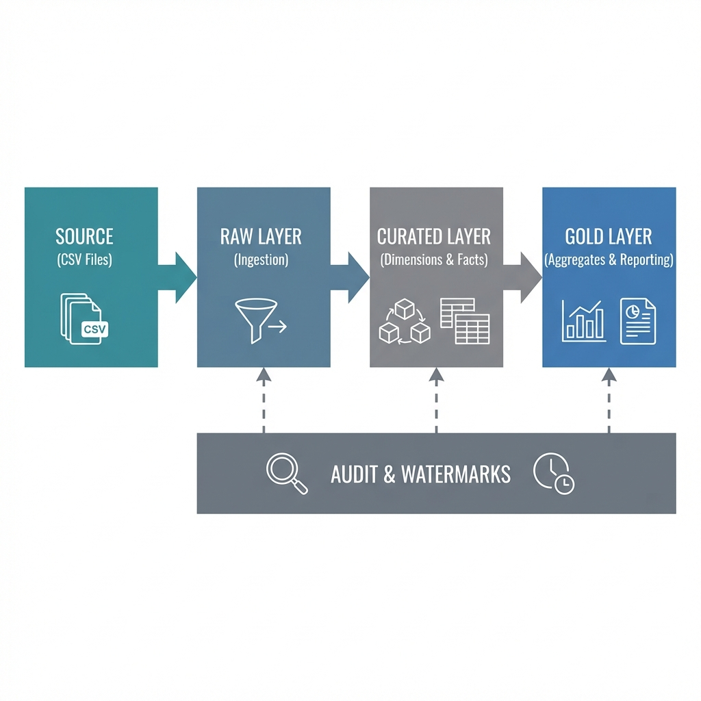
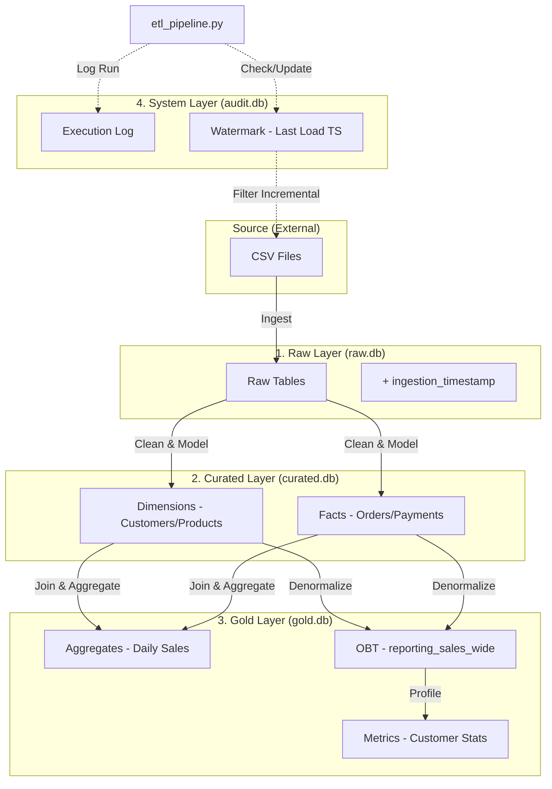

# Enterprise ETL Project Handover Notes

## 🏗️ Full Process Architecture
The following diagram illustrates the complete data flow, from the source CSV files through the Medallion layers (Raw, Curated, Gold), including the Audit and Watermark tracking system.



### Technical Flow (Mermaid Reference)


## 1. High-Level Process Execution
To achieve the **Initial Full Load**, we followed these enterprise data engineering steps:

1.  **Environment Reset**: We completely wiped the database state (`rm *.db`) to simulate a "Day 0" deployment.
2.  **Schema Initialization**: The pipeline automatically created the 4 empty database files (`Raw`, `Curated`, `Gold`, `Audit`).
3.  **Watermark Check**: The pipeline checked `pipeline_watermark` table.
    *   *Result*: Table empty (or did not exist).
    *   *Action*: Defaulted to "Load from 1900-01-01" (Full History Load).
4.  **Extraction**: Read 5 source CSVs and loaded them into `Raw` (adding metadata like `ingestion_timestamp`).
5.  **Transformation**:
    *   Cleaned Dimensions (`Customers`, `Products`).
    *   Enriched Facts (`Orders` joined with `Payments`).
6.  **Aggregation**: Created business-ready tables in `Gold`.
7.  **State Save**: Updated the `watermark` table with the current timestamp to mark the "high water mark".
    *   *Effect*: Next run will only process data arriving *after* this timestamp.

---

## 2. Design Rationale

### Why these specific Gold Tables?
We moved away from simple pass-through tables to purpose-built structures:

*   **`sales_summary_daily`**
    *   **Purpose**: Executive Dashboards / Trend Analysis.
    *   **Reason**: Computing daily totals from millions of rows is slow. We pre-aggregate it so the dashboard loads instantly (60 rows vs 3000 rows).
*   **`reporting_sales_wide`**
    *   **Purpose**: Self-Service BI (Tableau, PowerBI) & Analysts.
    *   **Reason**: This is an **OBT (One Big Table)**. It joins Orders + Lines + Products + Customers + Payments into a single wide view. Analysts can now query *one* table without needing to write complex SQL Joins.
*   **`reporting_customer_stats`**
    *   **Purpose**: Marketing & CRM.
    *   **Reason**: Provides "Customer Lifetime Value" (LTV) and "Churn Risk" (Last Order Date) at a glance. Helps marketing target VIP customers.

### Why Audit & Watermark Tables?
We separated "Observability" from "State".

*   **`pipeline_execution_log` (The Diary)**
    *   **What it is**: A history book of every single run.
    *   **Why**: If the pipeline fails tonight, you look here to see *why* and *when*. It grows forever (Append-only).
*   **`pipeline_watermark` (The Bookmark)**
    *   **What it is**: A lookup table storing the *last successful timestamp* for each process.
    *   **Why**: It tells the pipeline where to resume. Without this, you would process the same old data every day (duplicates) or miss new data. It updates (Overwrites) on every success.

---

## 3. Final System Inventory
Here is the exact state of your system after the Initial Load:

### 🟠 Raw Layer (`raw.db`)
*Source data ingested as-is with system columns.*
| Table Name | Record Count | Description |
| :--- | :--- | :--- |
| `customers` | **500** | Raw customer CSV data. |
| `orders` | **1000** | Raw order headers. |
| `order_lines` | **3064** | Individual line items. |
| `payments` | **1000** | Raw payment transactions. |
| `products` | **100** | Product catalog. |

### 🟡 Curated Layer (`curated.db`)
*Cleaned, Deduplicated, and Star Model (Facts & Dims).*
| Table Name | Record Count | Description |
| :--- | :--- | :--- |
| `dim_customers` | **500** | Unique customers with standardized names. |
| `dim_products` | **100** | Unique products. |
| `fact_orders` | **1000** | Cleaned order headers. |
| `fact_order_lines` | **3064** | Cleaned line items. |
| `fact_payments` | **1000** | Standardized payments (separated from orders). |

### 🟢 Gold Layer (`gold.db`)
*Business Aggregates for Reporting.*
| Table Name | Record Count | Description |
| :--- | :--- | :--- |
| `sales_summary_daily` | **60** | Daily revenue totals. |
| `reporting_sales_wide` | **3064** | Denormalized "Master Table" for BI. |
| `reporting_customer_stats` | **432** | Customer profiles & LTV metrics. |

### ⚙️ System Layer (`audit.db`)
*Operational Metadata.*
| Table Name | Record Count | Description |
| :--- | :--- | :--- |
| `pipeline_execution_log` | **4** | One entry for each step of the run. |
| `pipeline_watermark` | **4** | One entry for each process logic. |

---

## 4. Key Python Files Guide
These are the files that make the system work. You don't need to run all of them, but you should know what they do.

| File Name | Role | Should I Run It? |
| :--- | :--- | :--- |
| **`etl/etl_pipeline.py`** | **The Engine** | **YES.** This is the main file that loads data. |
| **`etl/config.py`** | **The Foundation** | No. It stores paths and database settings. |
| **`etl/audit_manager.py`** | **The Tracker** | No. It's used by the pipeline to log and save watermarks. |
| **`etl/verify.py`** | **The Auditor** | **Optional.** Run this to check if your data is correct. |
| **`etl/query_tool.py`** | **The Interface** | **YES.** Run this to see your data if the UI crashes. |

---

## 5. How to Run (Step-by-Step)

### To Load Data (Initial or Incremental):
Open your terminal and run:
```bash
python3 etl/etl_pipeline.py
```
*   **Day 1**: It will load everything (Full Load).
*   **Day 2**: It will only load new files (Incremental Load).

### To Check your Data:
```bash
python3 etl/query_tool.py
```
Follow the on-screen menu to select your database and table!

### To Verify Integrity:
```bash
python3 etl/verify.py
```
This will check if the totals in Gold match the totals in Curated.


