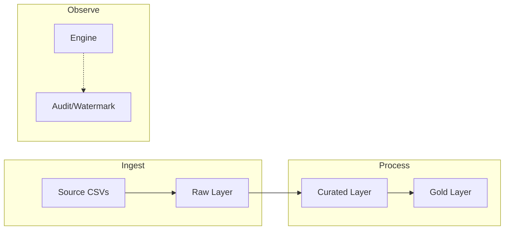

# Enterprise Medallion ETL Project

An enterprise-grade Data Engineering pipeline implementing the **Medallion Architecture** (Raw -> Curated -> Gold) using Python and SQLite. This project demonstrates high-quality ETL patterns including schema management, incremental loading with watermarks, and automated business logic verification.

## 🚀 Key Features
- **Medallion Architecture**: Clear separation of data layers (Raw, Curated, Gold).
- **Incremental Loading**: Uses a `pipeline_watermark` system to process only new data after the initial load.
- **Observability**: Built-in execution logging and data integrity auditing.
- **Reporting Ready**: Denormalized Gold layer tables (OBT) optimized for BI tools.

## 🏗️ Architecture Overview

The following diagram illustrates the data flow through the Medallion layers:



The pipeline organizes data into four logical databases:

1.  **🟠 Raw (`raw.db`)**: Direct ingestion of source CSVs. Data is stored "as-is" with additional ingestion metadata (`ingestion_timestamp`).
2.  **🟡 Curated (`curated.db`)**: Cleaned, standardized, and modeled data. Implements a Star Schema with Facts (`fact_orders`, `fact_payments`) and Dimensions (`dim_customers`, `dim_products`).
3.  **🟢 Gold (`gold.db`)**: Purpose-built business aggregates.
    - `sales_summary_daily`: Daily revenue trends.
    - `reporting_sales_wide`: A "One Big Table" (OBT) joining all facts and dimensions for easy reporting.
    - `reporting_customer_stats`: Customer lifetime value (LTV) and churn metrics.
4.  **⚙️ System (`audit.db`)**: Stores `pipeline_execution_log` (historical tracking) and `pipeline_watermark` (bookmarking for incremental loads).

## 📂 Project Structure

```text
DE_Project/
├── etl/
│   ├── etl_pipeline.py    # Main engine to run the data load
│   ├── config.py          # Database paths and project settings
│   ├── audit_manager.py   # Handles logging and watermark state
│   ├── verify.py          # Validates data integrity across layers
│   └── query_tool.py      # Interactive CLI to browse data
├── data/                  # Source CSV files
├── requirements.txt       # Project dependencies
└── README.md              # Project documentation
```

## 🛠️ Getting Started

### 1. Installation
```bash
pip install -r requirements.txt
```

### 2. Run the Pipeline
To load data (handles both initial full load and subsequent incremental loads):
```bash
python etl/etl_pipeline.py
```

### 3. Query the Results
Use the interactive query tool to browse your data:
```bash
python etl/query_tool.py
```

### 4. Verify Integrity
Run the automated auditing tool to ensure Gold totals match Curated records:
```bash
python etl/verify.py
```

## 📈 Design Rationale
- **Performance**: We pre-aggregate data in the Gold layer to ensure dashboards load instantly without performing heavy joins at runtime.
- **Ease of Use**: The `reporting_sales_wide` table allows analysts to perform self-service BI without needing to understand complex relational schemas.
- **Reliability**: The watermark system ensures no data is missed during ingestion and prevents duplicate processing.
